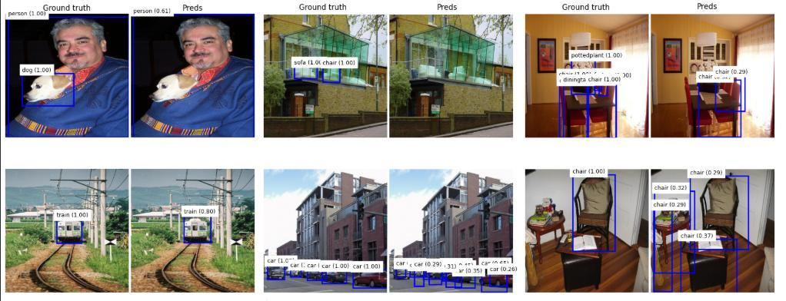

Slightly modyfied YOLO v1 implementation with Tensorflow.

**Dataset**:
- Model trained on PASCAL VOC 2007 without [head, hand, foot] classes (like in orginal paper). 

**How to start training**:
- Just run yolo_train.py file (assuming you have PASCAL VOC 2007 dataset in yolo_train.py directory). You may want to change img size to 448 x 448 like in paper (model trained on 350 x 350 due to lack of memory). 

**Project's structure**:
- yolo_train.py (start training)
- inference.ipynb (example file to inference model)
- yolo_loss.py (YOLO v1 loss implementation)
- yolo_model.py (Slightly modified YOLO v1 model)
- yolo_preprocessing.py (module with preprocessing functions and data loaders)
- /model_trained/model.keras (Model. Assuming you started training.)
- requirements.txt (Libraries used and their versions)

**Libraries and Versions**:
- python: 3.10.18
- tensorflow: 2.20.0
- sklearn: 1.7.2
- numpy: 2.1.3
- albumentations: 2.0.12
- PIL: 11.3.0

**Hyperparameters**:
- Learning rate: 1e-4
- Learning rate scheduler: CosineDecayRestarts
- Batch_size: 16
- Epochs: 250

**Augmentations**:
Model relies heavily on data augmentation, because dropout can destroy useful local patterns and makes coordinate
learning less stable. Augmentations used:
- RandomResizedCrop
- HorizontalFlip
- ShiftScaleRotate
- RandomBrightnessContrast
- HueSaturationValue
- RGBShift
- Blur
- MotionBlur
- GaussNoise
- CoarseDropout
- ImageCompression

**Project's potential extensions**:
- mAP metric